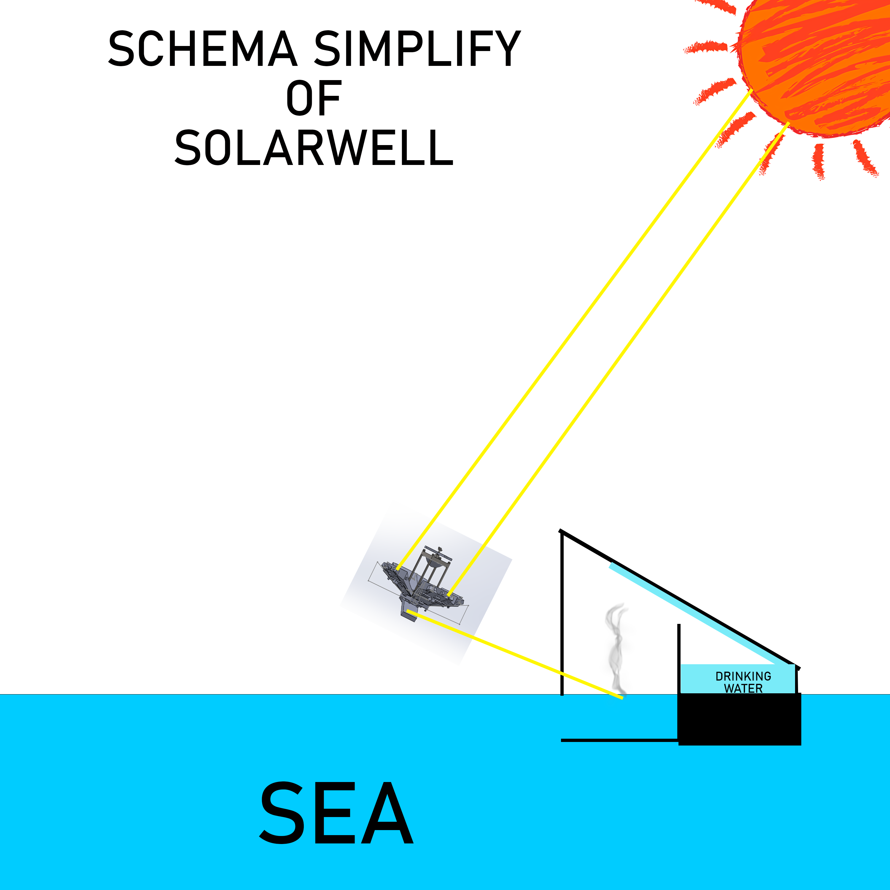

# 💧 SolarWell — Low-tech Solar Distillation & Purification

SolarWell is a **low-tech solar distillation** concept designed to turn **seawater** or polluted water into drinkable water using **only the sun**.

The project aims to be:
- **simple**, **repairable**, and **open-hardware**,
- compatible with **Solar Flare** as a heat source,
- and **couplable with SolarLift** to store part of the energy as gravitational potential.

---

## 🌞 Concept

SolarWell uses solar energy to:
1. **Evaporate** water (sea, brackish, slightly polluted),
2. **Condense** the vapor on a cooler surface,
3. **Collect** small but precious amounts of clean water.

The goal is not industrial performance, but:
- a bit of **water autonomy** at human scale,
- a **pedagogical tool** about heat and phase change,
- good integration with other low-tech building blocks.

---

## 🔗 Powered by Solar Flare

SolarWell is designed to work **in combination with**:

- **[Solar Flare](https://github.com/f-buisson/Solar-Flare)** – a foldable solar concentrator (Fresnel lens + mirrors), used here as a **heat source** for water heating and evaporation.

Without Solar Flare (or equivalent), SolarWell remains a **simple passive solar still**.  
Together, they form a small modular chain: **sun → concentrated heat → accelerated evaporation → drinkable water**.

---

## ⚙️ Operation (basic module)

- A **dark basin** holds raw water (sea / brackish / slightly polluted).
- A **transparent cover** (glass / plastic) lets sunlight in via Solar Flare and traps heat.
- The water heats up, evaporates, then **condenses** on the inner face of the cover.
- The condensed droplets **run down** into a collection channel → **clean water output**.

---

## ☀️ Sun tracking (orientation)

SolarWell’s efficiency depends a lot on how well **Solar Flare** is oriented toward the sun.  
The better the concentrator tracks the sun, the higher the evaporation rate and the more drinkable water you can get per day.

For now, SolarWell assumes either:
- **simple manual adjustment** of Solar Flare a few times per day, or  
- a future **passive / hybrid tracking system** reused from Solar Flare.

For more details and concept ideas about sun tracking:
👉 [Sun_Tracking_concepts (Solar Flare)](https://github.com/f-buisson/Solar-Flare/blob/main/docs/Sun_Tracking_concepts.md)

---

## 🧪 Example use cases

Some possible scenarios for SolarWell:

1. **Backup or emergency drinking water**
   - Small coastal village, islet, isolated cabin.
   - Produce a few liters of drinking water per day, with no electricity.

2. **Educational tool**
   - Show how:
     - sun → heat → evaporation → condensation → drinking water.
   - Connect to: water cycle, thermodynamics, low-tech design.

3. **Complement to rainwater harvesting**
   - When rain is rare or tanks are limited,
   - SolarWell provides an extra trickle of potable water.

4. **Symbolic autonomy cell**
   - Combined with SolarLift and Solar Flare,
   - one module provides **a bit of water** and **a bit of stored energy**,
   - illustrating what a tiny resilient micro-node could look like.

> ⚠️ All orders of magnitude (liters/day, surface area) depend heavily on sun, design, materials and maintenance.  
> SolarWell is first and foremost an **open R&D platform**, not a guaranteed industrial product.

---

## 🔐 License & Usage Conditions

This project is released as **open-hardware**: you are free to **study**, **modify**, **repair** and **reproduce** it.

- **Personal / educational / non-commercial use** → Allowed ✅  
  (CERN-OHL-S 2.0 + CC BY-NC-SA 4.0)

- **Professional / commercial use** → requires a **dedicated license**  
  (to support development, cover R&D costs and avoid misuse)  
  👉 https://scgfamp.lemonsqueezy.com/buy/8430de49-9b31-4802-a4e6-0b24f7f69aad

> **Note:** Commercial-use rights are **automatically granted** if an active  
> GitHub sponsorship is maintained at the **€350/month tier (or higher)**.  
> If the sponsorship is downgraded or cancelled, commercial authorization **ends immediately**.  
> No retroactive or permanent rights are kept after sponsorship stops.

---

## 📣 Contribution & ideas

Proposals for:
- geometries,
- materials (covers, basins, seals),
- coupling with SolarLift or BioSym modules,

are welcome.  
You can open an **issue** or submit a **pull request**.

---

### 🫶 Support this project

I publish these projects as **open-hardware** so that anyone can understand them, adapt them and rebuild them freely.  
If you’d like to contribute to their evolution and to the creation of new prototypes:  
👉 https://github.com/sponsors/f-buisson  

Even a symbolic contribution helps to:
- fund necessary materials  
- develop and test prototypes  
- cover software licensing (SolidWorks, etc.)

Thank you for your support ✦

---

# 💧 SolarWell — Distillation solaire low-tech & épuration

SolarWell est un concept de **distillation solaire low-tech** destiné à transformer de l’**eau de mer** ou de l’eau polluée en eau potable, en utilisant **uniquement le soleil**.

Il vise à être :
- **simple**, **réparable** et **open-hardware**,
- compatible avec **Solar Flare** comme source de chaleur,
- et **couplable avec SolarLift** pour stocker une partie de l’énergie sous forme gravitaire.

---

## 🌞 Concept

SolarWell utilise l’énergie solaire pour :
1. **Évaporer** l’eau (mer, saumâtre, légèrement polluée),
2. **Condenser** la vapeur sur une surface plus froide,
3. **Collecter** de petites quantités d’eau propre mais précieuse.

L’objectif n’est pas la performance industrielle, mais :
- une petite **autonomie en eau** à échelle humaine,
- un support **pédagogique** sur la chaleur et le changement d’état,
- une bonne intégration avec d’autres briques low-tech.

---

## 🔗 Alimenté par Solar Flare

SolarWell est pensé pour fonctionner **en combinaison avec** :

- **[Solar Flare](https://github.com/f-buisson/Solar-Flare)** – un concentrateur solaire pliable (lentille de Fresnel + miroirs), utilisé ici comme **source de chaleur** pour le chauffage de l’eau et l’évaporation.

Sans Solar Flare (ou équivalent), SolarWell reste un **simple distillateur solaire passif**.  
Ensemble, ils forment une petite chaîne modulaire **soleil → concentration de chaleur → évaporation accélérée → eau potable**.

---

## ⚙️ Fonctionnement (module de base)

- Un **bac sombre** contient de l'eau brute (mer / saumâtre / légèrement polluée).
- Un **couvercle transparent** (verre / plastique) laisse passer le soleil via Solar Flare et piège la chaleur.
- L’eau se réchauffe, s’évapore, puis **condense** sur la face interne du couvercle.
- Les gouttes condensées **ruissellent** vers un canal de collecte → **eau propre en sortie**.

---

## ☀️ Suivi du soleil (orientation)

Le rendement de SolarWell dépend fortement de la qualité de l’**orientation de Solar Flare** vers le soleil.  
Plus le concentrateur suit bien le soleil, plus le débit d’évaporation est élevé et plus on peut obtenir d’eau potable chaque jour.

Pour l’instant, SolarWell suppose soit :
- un **ajustement manuel simple** de Solar Flare quelques fois par jour,  
- soit un futur système de suivi **passif / hybride** réutilisé depuis Solar Flare.

Pour plus de détails et d’idées de concepts de suivi solaire :
👉 [Sun_Tracking_concepts (Solar Flare)](https://github.com/f-buisson/Solar-Flare/blob/main/docs/Sun_Tracking_concepts.md)

---

## 🧪 Exemples d’usages

Quelques scénarios possibles pour SolarWell :

1. **Eau potable d’appoint ou de secours**
   - Petit village côtier, îlot, cabane isolée.
   - Produire quelques litres d’eau potable par jour, sans électricité.

2. **Support pédagogique**
   - Montrer comment :
     - soleil → chaleur → évaporation → condensation → eau potable.
   - Relier à : cycle de l’eau, thermodynamique, design low-tech.

3. **Complément à la récupération d’eau de pluie**
   - Quand la pluie est rare ou les cuves limitées,
   - SolarWell fournit un filet supplémentaire d’eau potable.

4. **Cellule symbolique d’autonomie**
   - Combiné avec SolarLift et Solar Flare,
   - un module fournit **un peu d’eau** et **un peu d’énergie stockée**,
   - pour illustrer ce que peut être un micro-nœud résilient.

> ⚠️ Tous les ordres de grandeur (litres/jour, surface) dépendent fortement du soleil, du design, des matériaux et de la maintenance.  
> SolarWell se veut d’abord une **plateforme de R&D ouverte**, pas un produit industriel garanti.

---

## 🔐 Licence & Conditions d’usage

Ce projet est publié en **open-hardware** : vous êtes libre de l’**étudier**, le **modifier**, le **réparer** et le **reproduire**.

- **Usage personnel / éducatif / non-commercial** → Autorisé ✅  
  (CERN-OHL-S 2.0 + CC BY-NC-SA 4.0)

- **Usage professionnel / commercial** → nécessite une **licence dédiée**  
  (afin de soutenir le développement, couvrir les coûts R&D et éviter les abus)  
  👉 https://scgfamp.lemonsqueezy.com/buy/8430de49-9b31-4802-a4e6-0b24f7f69aad

> **Note :** Le droit d’usage commercial est **automatiquement accordé** si un
> sponsoring GitHub est actif au **palier de 350€/mois (ou supérieur)**.  
> Si le sponsoring est réduit ou annulé, l’autorisation commerciale **prend fin immédiatement**.  
> Aucun droit rétroactif ou permanent n’est conservé après l’arrêt du sponsoring.

---

## 📣 Contribution & idées

Propositions de :
- géométries,
- matériaux (couvercles, bacs, joints),
- couplages avec SolarLift ou des modules BioSym,

sont les bienvenues.  
Vous pouvez ouvrir une **issue** ou proposer une **pull request**.

---

### 🫶 Soutenir ce projet

Je publie ces projets en **open-hardware**, pour que chacun puisse les comprendre, les adapter et les reconstruire librement.  
Si tu souhaites contribuer à leur évolution et à la création de nouveaux prototypes :  
👉 https://github.com/sponsors/f-buisson  

Chaque contribution (même symbolique) permet de :
- financer les matériaux nécessaires  
- développer et tester les prototypes  
- couvrir les licences logicielles (SolidWorks, etc.)

Merci pour ton soutien ✦
